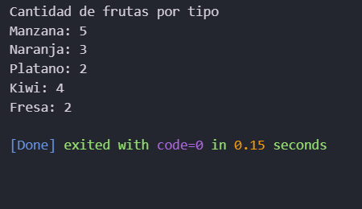

#Numero de Frutas por Tipo aplicando arreglos, Ciclos FOR y estructura de control IF ELSE

frutas[
  "manzana",
  "naranja",
  "platano",
  "kiwi",
  "fresa",
  "manzana",
  "manzana",
  "naranja",
  "platano",
  "kiwi",
  "fresa",
  "manzana",
  "manzana",
  "naranja",
  "kiwi",
  "kiwi"];

  RESULTADO: 

  